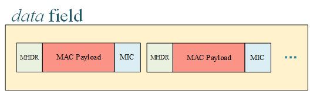

## Connector

The LoRa network connector serves as the entrance of the whole X-LoRa system.

LoRa网络连接器充当整个X-LoRa系统的入口。

### Functions

* **Gateway Connections**

   LoRa gateways directly connect to LoRa network connector and upload and download data for LoRa devices. The format of packages follows the Gateway to Server Interface Definition by Semtech™ Corporation, which can be referred in [Interaction with LoRa Gateways Section](#interaction-with-loratm-gateways). The communications are carried on UDP. Connector will record two UDP ports for gateways separately, i.e., *pull port* and *push port*, after receiving corresponding type of data. Further downlink data is sent to the matching port. 

   LoRa网关直接连接到LoRa网络连接器，并上传和下载LoRa设备的数据。 软件包的格式遵循Semtech™Corporation的“网关到服务器接口的定义”，可在[与LoRa网关的交互部分]（＃interaction-with-loratm-gateways）中引用。 通信在UDP上进行。 在接收到相应类型的数据后，连接器将分别记录网关的两个UDP端口，即* pull端口*和* push端口*。 进一步的下行链路数据被发送到匹配端口。

* **Package Encapsulation and De-capsulation**

   One of the main jobs of LoRa network connector is to parse and encapsulate packages received from LoRa Gateways. Data from LoRa devices are kept in *data* field as an array in gateway packages. These data are byte sequences originally and encoded in *base64* format before uploading. The illustration below shows how the data of devices are packaged.

   LoRa网络连接器的主要工作之一是解析和封装从LoRa网关收到的软件包。 来自LoRa设备的数据作为网关包中的数组保存在* data *字段中。 这些数据最初是字节序列，并在上载之前以* base64 *格式进行编码。 下图显示了如何打包设备数据。

   

   After receiving packages from gateways, connector needs to extract device data from data field and decode each element with base64. Then, each data is parsed by bytes according to the message type that is come up with the MHDR field. All message types defined in LoRaWAN™ 1.1 are well supported. After each field is sliced, some necessary verifications are conducted, as well as decryption, which can be referred at following paragraphs. When everything’s fine, the message is published to the message queue on topic NC-pub for those subscribers interested. The message format is defined in [Interaction with LoRa Server Section](#interaction-with-loratm-server). 

   从网关接收软件包后，连接器需要从数据字段中提取设备数据，并使用base64解码每个元素。 然后，根据MHDR字段附带的消息类型，按字节分析每个数据。 很好地支持了LoRaWAN™1.1中定义的所有消息类型。 在对每个字段进行切片之后，将进行一些必要的验证以及解密，可以在以下段落中进行介绍。 一切正常后，对于感兴趣的订阅者，邮件将发布到主题NC-pub上的邮件队列中。 消息格式在[与LoRa服务器的交互部分]（＃interaction-with-loratm-server）中定义。

   The LoRa network connector has also subscribed a topic named *NC-sub* where it can receive downlink messages for LoRa devices and encapsulate them to byte sequences. During this process, the messages are encrypted and the *MIC* is calculated. Then, the messages are encoded by *base64* and inserted into the *data* field of the JSON document for gateways. This kind of messages is called *PULL_RESP*, and forwarded to the *pull port* of gateways over UDP.

   LoRa网络连接器还订阅了一个名为* NC-sub *的主题，它可以在其中接收LoRa设备的下行链路消息并将其封装为字节序列。 在此过程中，将对消息进行加密并计算* MIC *。 然后，这些消息由* base64 *编码，并插入到网关的JSON文档的* data *字段中。 这种消息称为* PULL_RESP *，并通过UDP转发到网关的* pull port *。

* **Verification**

   LoRa network connector is responsible for necessary message verifications and prevent illegal messages from entering the systems. All checks are listed below for clarity.

   LoRa网络连接器负责必要的消息验证，并防止非法消息进入系统。 为了清楚起见，下面列出了所有检查。

   |      Item       |            Further Description            |      Action       |
   | :-------------: | :---------------------------------------: | :---------------: |
   |  MIC Mismatch   |              Data corruption              |      Discard      |
   | Identify Error  |     Device or gateway does not exist      |      Discard      |
   | Illegal Format  | Message is not assembled in standard way  |      Discard      |
   | Out of Boundary |      Data exceed the maximum length       |      Discard      |
   |   FCnt Error    | The count of message frames is discordant | Discard or Ignore |

* **Security**

   LoRa network connector needs to encrypt and decrypt data to ensure privacy. The detailed processes of encryption and decryption can be found in LoRaWAN™ 1.0.2 standard. Connector is strictly stick to the standard to guarantee it accordance. Devices must make sure the root key *AppKey* is carefully saved in their hardware.

   LoRa网络连接器需要加密和解密数据以确保隐私。 加密和解密的详细过程可以在LoRaWAN™1.0.2标准中找到。 连接器严格遵守标准，以确保符合标准。 设备必须确保根密钥* AppKey *已仔细保存在其硬件中。

   On the other hand, the transmission between gateways and connector is transparent, which could bring security vulnerabilities. This can be fixed by conducting secured version of UDP (such as DTLS where TLS is used in UDP) both in connector side and gateway sides.

   另一方面，网关和连接器之间的传输是透明的，这可能带来安全漏洞。 可以通过在连接器端和网关端执行UDP的安全版本（例如UDP中使用TLS的DTLS）来解决此问题。

* **Load Balancing, Availablity and Throttling**

   LoRa network connector has also considered the performance since it is the entrance of the backend servers. Load balancing can be applied by deploying multiple connectors and proper schedule algorithms. The availability, in this way, is also kept. Throttling is required in connector to keep the vicious data flood out of the house.

   LoRa网络连接器还考虑了性能，因为它是后端服务器的入口。 可以通过部署多个连接器和适当的调度算法来应用负载平衡。 以这种方式，可用性也得以保持。 连接器需要进行限制，以防止恶意数据泛滥。

### Interaction with LoRa Gateways

The LoRa network connector interacts with LoRa gateways with **six** types of messages in total. The detailed format can be learned from the open documents of Semtech™ Corporation. Here, we only give some brief instructions. 

LoRa网络连接器与LoRa网关进行交互，总共具有**六种**类型的消息。 可以从Semtech™Corporation的公开文档中了解详细的格式。 在这里，我们仅给出一些简要说明。

The following three messages are sent from **gateway** to **connector**.

* **PULL_DATA**

   This message should be sent periodically by gateways to inform connector that the current gateway is alive. Besides, the UDP port gateway used to send PULL_DATA is recorded as *pull port*.

   网关应定期发送此消息，以通知连接器当前网关处于活动状态。 此外，用于发送PULL_DATA的UDP端口网关记录为* pull端口*。

* **PUSH_DATA**

   This message contains a JSON object where three main kinds of data, i.e., the status of gateway itself, the status of LoRa device and the uplink data. The key names are *stat*, *rxpk* and *data* (inside *rxpk* field), respectively. The *rxpk* field is defined as an array so that it can contain multiple messages from different devices. This JSON object is serialized with ASCII-only characters and must not exceed 2048 octets. An example JSON object is listed below, which contains a *stat* field and one *rxpk* field. 

   该消息包含一个JSON对象，其中包含三种主要数据，即网关本身的状态，LoRa设备的状态和上行链路数据。 键名分别是* stat *，* rxpk *和* data *（在* rxpk *字段内部）。 * rxpk *字段被定义为一个数组，因此它可以包含来自不同设备的多个消息。 此JSON对象使用仅ASCII字符序列化，并且不得超过2048个八位字节。 下面列出了一个示例JSON对象，其中包含一个* stat *字段和一个* rxpk *字段。

```json
   { rxpk:
      [ { tmst: 1545034506,
          chan: 7,
          rfch: 0,
          freq: 435.9,
          stat: 1,
          modu: 'LORA',
          datr: 'SF12BW125',
          codr: '4/5',
          lsnr: 2,
          rssi: -119,
          size: 24,
          data: 'gJbhkgAgTQCw9hsOerYkPu9D' } ],
     stat:
      { time: '2018-12-17 16:15:06 GMT',
        rxnb: 1,
        rxok: 0,
        rxfw: 0,
        ackr: 100,
        dwnb: 0,
        txnb: 0 } 
   }
```

   The UDP port used by PUSH_DATA will be marked as *push port* in connector. 

   PUSH_DATA使用的UDP端口在连接器中将标记为* push port *。

* **TX_ACK**

   This message is used to acknowledge the connector that the PULL_RESP (will be described below) message is received and some (maybe no) errors occurred.

   该消息用于确认连接器已接收到PULL_RESP（将在下面进行描述）消息，并且发生了一些（可能没有）错误。

   

The following three kinds of messages are sent from **connector** to **gateways**.

* **PULL_ACK**

   This is to acknowledge the gateways that the PULL_DATA is successfully received.

   这是为了确认网关已成功接收到PULL_DATA。

* **PUSH_ACK**

   This is to acknowledge the gateways that the PUSH_DATA is successfully received.

   这是为了确认网关已成功接收到PUSH_DATA。

* **PULL_RESP**

   This kind of message is used for connector to send downlink message to gateways. It has a similar structure as *rxpk* except that the key name of JSON object is changed to *txpk* and the total length cannot exceed 1000 octets. An example PULL_RESP message is shown as follow,

   这种消息用于连接器将下行消息发送到网关。 它具有与* rxpk *类似的结构，除了JSON对象的键名更改为* txpk *并且总长度不能超过1000个八位位组。 PULL_RESP消息示例如下所示，

```json
   {‘txpk’: {'codr': '4/5',
    'data': 'oJbhkgCjfwcGBgaWMvobrA==',
    'datr': 'SF12BW125',
    'freq': 435.9,
    'imme': False,
    'ipol': False,
    'modu': 'LORA',
    'powe': 25,
    'rfch': 0,
    'size': 16,
    'tmst': 1546035144}
   }
```

   The PULL_RESP is sent to the gateway through *pull_port*. Therefore, gateways MUST send PULL_DATA before any PULL_RESP can be received.

   PULL_RESP通过* pull_port *发送到网关。 因此，网关必须在可以接收任何PULL_RESP之前发送PULL_DATA。

### Interaction with LoRa Server

The connector publishes its uplink data to *message queue* and receive downlink data from it. In our X-LoRa system, the LoRa network server is responsible for direct interaction with connector. Therefore, network server will subscribe topic *NC-pub* and publish data on topic *NC-sub*. The data exchange format between connector and network server is defined in this section. 

连接器将其上行链路数据发布到*消息队列*并从中接收下行链路数据。 在我们的X-LoRa系统中，LoRa网络服务器负责与连接器直接交互。 因此，网络服务器将订阅主题* NC-pub *并发布关于主题* NC-sub *的数据。 连接器和网络服务器之间的数据交换格式在本节中定义。

* **Connect to Network Server**

   Connector needs to upload all necessary and plain data to network server for further processing. In order to ensure consistency, the data format is designed the same as the LoRaWAN™ MAC payloads with each field parsed and pre-processed. On the other hand, the meta data (*stat* and *rxpk*) will also be sent without any changes. The example JSON format of an uplink message from connector is shown below,

   连接器需要将所有必要的纯数据上传到网络服务器以进行进一步处理。 为了确保一致性，数据格式被设计为与LoRaWAN™MAC有效载荷相同，并对每个字段进行了解析和预处理。 另一方面，元数据（* stat *和* rxpk *）也将被发送而没有任何更改。 来自连接器的上行链路消息的示例JSON格式如下所示，

```json
   { version: <Buffer 02>,
     token: <Buffer 93 b9>,
     identifier: <Buffer 00>,
     gatewayId: <Buffer 00 00 00 00 00 00 00 00>,
     stat:
       { time: '2018-12-17 16:43:16 GMT',
         rxnb: 1,
         rxok: 0,
         rxfw: 0,
         ackr: 100,
         dwnb: 0,
         txnb: 0 },
     rxpk:
       [ { tmst: 1545036196,
           chan: 7,
           rfch: 0,
           freq: 435.9,
           stat: 1,
           modu: 'LORA',
           datr: 'SF12BW125',
           codr: '4/5',
           lsnr: 2,
           rssi: -119,
           size: 24,
           data:
            { MHDR: { MType: 4, Major: 0 },
              MACPayload:
               { FHDR:
                  { DevAddr: <Buffer 00 92 e1 96>,
                    FCtrl: { ADR: 0, ADRACKReq: 0, ACK: 1, ClassB: 0, FOptsLen: 0 },
                    FCnt: <Buffer 00 00 00 53>,
                    FOpts: [ ] },
                 FPort: <Buffer d2>,
                 FRMPayload: <Buffer 68 65 6c 6c 6f> },
              },
           raw: 'gJbhkgAgUwDSxFa50NDuZxdj' },
       ]
   }
```

* **Network Server to Connector**

   The downlink data from network server to connector follows the same pattern so that here only gives an example for reference, 

   从网络服务器到连接器的下行链路数据遵循相同的模式，因此这里仅提供示例供参考，

```json
   { version: <Buffer 02>,
     token: <Buffer 3e 7d>,
     identifier: <Buffer 03>,
     gatewayId: <Buffer 00 00 00 00 00 00 00 00>,
     txpk:
      { imme: false,
        tmst: 1546036645,
        freq: 435.9,
        rfch: 0,
        powe: 25,
        datr: 'SF12BW125',
        modu: 'LORA',
        codr: '4/5',
        ipol: false,
        data:
         { MHDR: { MType: 5, Major: 0 },
           MACPayload:
            { FHDR:
               { DevAddr: <Buffer 00 92 e1 96>,
                 FCtrl: { ACK: 1, ADR: true, FPending: 0, FOptsLen: 3 },
                 FCnt: <Buffer 00 00 07 85>,
                 FOpts: [ { '06': {} }, { '06': {} }, { '06': {} },] },
              FPort: <Buffer e6> } } } }
```

---