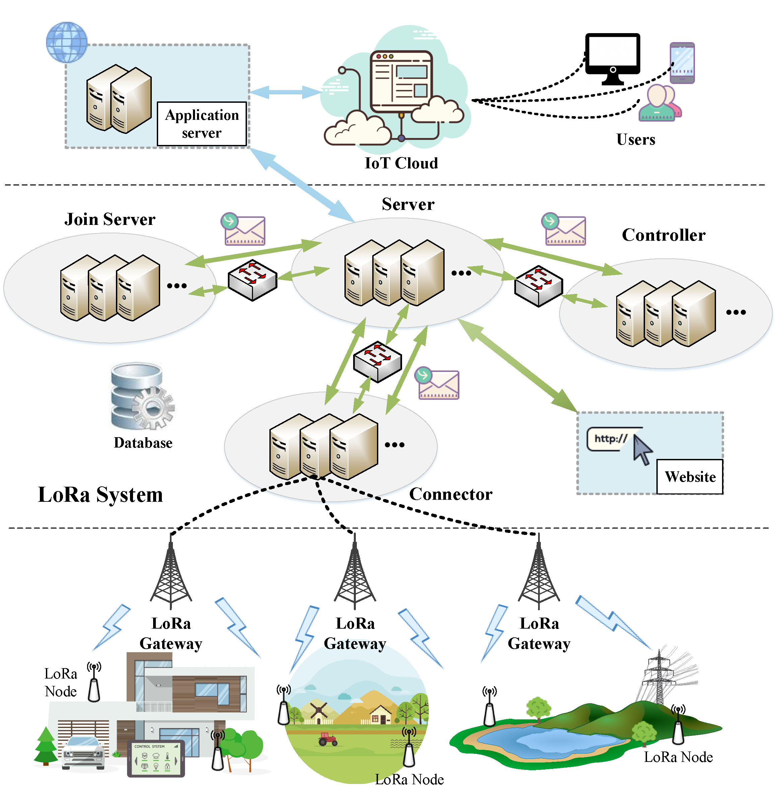

# Overview

## What is LoRa™ & LoRaWAN™

### LoRa™

Long Range (LoRa™) is one of the most promising wireless data communication technologies designed for low-power Internet of things (IoT) devices to achieve long-range transmission. LoRa™ consists of two main parts, i.e., LoRa™ and LoRaWAN™. LoRa™ is the physical layer and defines a kind of wireless modulation over a license-free frequency band. This kind of spread spectrum modulation technique is improved from chirp spread spectrum (CSS) technology. It can increase the communication range significantly while keeping the same low-power characteristics as Frequency Shift Keying (FSK). LoRaWAN™ defines the upper layer of LoRa™ and is discussed below.

远程（LoRa™）是最有前途的无线数据通信技术之一，专为低功耗的物联网（IoT）设备而设计，以实现远程传输。 LoRa™由两个主要部分组成，即LoRa™和LoRaWAN™。 LoRa™是物理层，它定义了一种在免许可证频段上的无线调制。 这种扩频调制技术是对线性调频扩频（CSS）技术的改进。 它可以显着增加通信范围，同时保持与频移键控（FSK）相同的低功耗特性。 LoRaWAN™定义了LoRa™的上层，下面将进行讨论。

### LoRaWAN™

The LoRaWAN™ specification is a Low Power Wide Area networking (LPWAN) protocol based on LoRa™ technology. This specification is released by LoRa Alliance™. It describes the communication and system architecture for LoRa networks. LoRaWAN network architecture is designed as a star-of-stars topology in which end-devices send messages to the central network server through the gateways. 

LoRaWAN™规范是基于LoRa™技术的低功耗广域网（LPWAN）协议。 该规范由LoRa Alliance™发布。 它描述了LoRa网络的通信和系统架构。 LoRaWAN网络体系结构设计为星型拓扑，其中终端设备通过网关将消息发送到中央网络服务器。

---

## What is X-LoRa System

FleXsible LoRa (X-LoRa) system project is designed for building LoRaWAN networks which is hosted on the GitHub platform. The system is used to manage and aggregate the gateways, the applications and the devices. It receives messages from gateways and send the data to the applications.

FleXsible LoRa（X-LoRa）系统项目旨在构建托管在GitHub平台上的LoRaWAN网络。 该系统用于管理和聚合网关，应用程序和设备。 它从网关接收消息，并将数据发送到应用程序。

The project provides a ready-to-use solution for users including web-interface and HTTP APIs. For example, Application server manages application payloads and web management server offers a UI interface for users to access and modify their gateways, applications and devices. Furthermore, the HTTP APIs are designed so that the LoRa system may be integrated into other platforms.

该项目为用户提供了即用型解决方案，包括Web界面和HTTP API。 例如，应用程序服务器管理应用程序有效负载，而Web管理服务器提供UI界面，供用户访问和修改其网关，应用程序和设备。 此外，设计了HTTP API，以便可以将LoRa系统集成到其他平台中。

A complete LoRa network is composed of several parts, i.e., LoRa device, LoRa gateway and LoRa system. The X-LoRa system is proposed to facilitate the implementation and management of private LoRa networks. X-LoRa consists of four modules, which are responsible for different tasks and services such as protocol processing and device activation. Application server is designed to customize the structure and encryption of various application payload. The web project makes it easy for administrators to manage LoRa devices and various applications.

完整的LoRa网络由几个部分组成，即LoRa设备，LoRa网关和LoRa系统。 提出X-LoRa系统是为了促进私有LoRa网络的实施和管理。 X-LoRa由四个模块组成，分别负责不同的任务和服务，例如协议处理和设备激活。 应用程序服务器旨在自定义各种应用程序有效负载的结构和加密。 该Web项目使管理员可以轻松管理LoRa设备和各种应用程序。

The implementation details of X-LoRa system are described below, as well as the tutorials for deploying and using such a system.

X-LoRa系统的实现细节在下面进行了介绍，并介绍了如何部署和使用这种系统的教程。

---

## Architecture

Our X-LoRa System consists of six main components:

我们的X-LoRa系统包含六个主要组件：

* Connector
* Server
* Join Server
* Controller
* Application Server
* Web management server

Connector is the bridge between the LoRa gateway and Server, which provides the services for parsing and packaging the payload of Media Access Control (MAC) layer. Server is responsible for data management and service scheduling. Join Server is proposed to handle the activation requests of LoRa devices. Controller focuses on processing and managing MAC commands exchanged between LoRa server and LoRa devices in order to adjust LoRa™ transmission parameters. Application Server is responsible for the handling, encryption and decryption of application payloads. Web management server is designed as a user interface that allows for easy management of applications and devices via a web browser.

连接器是LoRa网关和服务器之间的桥梁，该服务器提供用于解析和打包媒体访问控制（MAC）层有效负载的服务。

服务器负责数据管理和服务调度。

建议使用Join Server来处理LoRa设备的激活请求。

控制器专注于处理和管理在LoRa服务器和LoRa设备之间交换的MAC命令，以便调整LoRa™传输参数。

Application Server负责处理，加密和解密应用程序有效负载。

Web管理服务器被设计为用户界面，允许通过Web浏览器轻松管理应用程序和设备。

---

## Features

* **High Performance**

X-LoRa system can reach a very high performance on concurrency and latency. The whole system is developed in Node.js which is expert in asynchronous I/O, making it fast to handle thousands of requests concurrently. 

X-LoRa系统可以在并发性和延迟方面达到很高的性能。 整个系统在Node.js中开发，Node.js是异步I / O的专家，可以快速地同时处理数千个请求。

* **Scalability**

X-LoRa uses message queue to unite each component. Therefore, it can be easily scaled up by adding devices to the clusters to deal with growing size.

X-LoRa使用消息队列来组合每个组件。 因此，可以通过将设备添加到群集以应对不断增长的规模来轻松扩展规模。

* **Open Source**

X-LoRa system is totally open source and hosted on Github under license GPL-3.0. Welcome to make contributions and feel free to use X-LoRa anywhere you like.

X-LoRa系统是完全开源的，并以GPL-3.0许可证托管在Github上。 欢迎您做出贡献，并随时随地在任何地方使用X-LoRa。

* **Gateway Routing**

X-LoRa server manages routing of downlink messages in order to ensure that the gateway which has the best channel quality with target device can be assigned to forward the messages. 

X-LoRa服务器管理下行消息的路由，以确保可以分配与目标设备具有最佳信道质量的网关来转发消息。

* **Adaptive Data Rate**

An efficient ADR scheme is deployed in X-LoRa, which is proposed in LoRaWAN™ specification. The ADR scheme running on Controller is responsible for controlling the data rate and transmission power of LoRa devices, so that they can ensure the successful transmission of packets while reducing the energy consumption. Enabling ADR scheme can significantly improve spectrum utilization and the battery lifetime of LoRa devices. Of course, LoRa devices can choose whether to turn this mechanism on or not by the ADR flag bit of the uplink packet. In addition, the ADR scheme only applies to stationary LoRa devices because it may not be possible when the radio channel attenuation changes fast and constantly. 

在LoRaWAN™规范中提出的X-LoRa中部署了有效的ADR方案。 在Controller上运行的ADR方案负责控制LoRa设备的数据速率和传输功率，以便它们可以确保成功传输数据包，同时降低能耗。 启用ADR方案可以显着提高LoRa设备的频谱利用率和电池寿命。 当然，LoRa设备可以通过上行链路数据包的ADR标志位选择是否启用此机制。 此外，ADR方案仅适用于固定式LoRa设备，因为当无线电信道衰减快速且持续变化时，它可能无法实现。

* **Customizable**

Each of the component of X-LoRa system can be customized as long as the format of messages are matched. 

只要消息格式匹配，就可以自定义X-LoRa系统的每个组件。

* **Application Integration and APIs**

The application data is published to the message queue on a certain topic. Therefore, external applications can be integrated to X-LoRa by subscribing the topic. Besides, X-LoRa provides a bunch of HTTP APIs to enable service integration.

应用程序数据将发布到有关特定主题的消息队列中。 因此，可以通过订阅该主题将外部应用程序集成到X-LoRa。 此外，X-LoRa提供了许多HTTP API来实现服务集成。

---